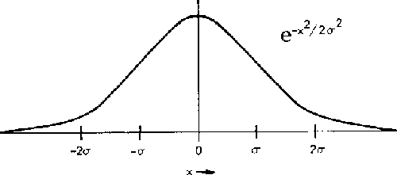

#   Aprendizagem de Máquina

Um programa aprende a partir de experiências (**E**) com respeito a alguma classe de tarefas (**T**) e medida de desempenho (**P**), se o desempenho de tarefas em T, medido por P, melhora com experiências E.

* Experiências (**E**)
* Tarefas (**T**)
* Medida de Desempenho (**P**)

##  Tipos de Aprendizagem
|       Supervisionado      |       Não-supervisionado      |
|       ----------------    |       ----------------        |
|  Busca uma função de erro |       Estrutura espacial      |
|       Rótulo, clase       |       Não há rótulos          |
|       $f(x) \to y$        | Requere análise especialista  |

##  Regressão
* Tipo de aprendizado supervisionado
* Mapear variáveis de entrada para uma função continua

## Fitness

|                   Underfitting                        |               Overfitting                  |
|    -------------------------------------------        |    --------------------------------------- |
| Não consegue representar o conjunto de treinamento    |           Representa funções demais        |
|  Não é capaz de **generalizar** |      Converge para um classificador baseado em memória (**f memo**)  |

* **Generalização**: É capaz de representar dados nunca vistos
* **f memo**: Classificador baseado em memoria
    - Representa o proprio conjunto de treinamento
    - Não representa bem dados nunca vistos

##  K Nearest Neighbors (K Vizinhos mais próximos) -- KNN
* Classificação (Supervisionado)
* Espaço (Álgebra Linear)
    - Ponto de consulta (*query point*): Verificar quais são os K pontos mais próximos
    - Distância
    - Classe dos pontos mais próximos
        - Ex:
            ```
            K = 3 (Mais próximos)
            1 A, 2 B -> resposta B
            K = 2 (Mais próximos)
            1 A, 1 B -> Inconclusivo
            ```
        - Resposta por indução probabilistica
    - Idealmente, K deve ser igual ou maior ao númeero de classes possiveis

### Algoritmo *KNN*
1. Compara a distância euclidiana da query com cada uma das linhas do dataset
2. Ordena os resultados
3. Agrupa os K primeiros resultados ordenados por Classificador
4. O resultado do algoritmo é o grupo que tiver mais ocorrências

##  K-Means (K-Médias)
* Clustering (Não-supervisionado)
    - Medida de similaridade
* Quando não há acesso aos rótulos
* Pontos próximos constituem um grupo (*cluster*)
    - Viés (Hiperesferas)
* Número fixo de *clusters*

### Algoritmo *KMeans*
1. Define o número de *clusters* (**N**)
2. Define um limiar de convergência
3. Define N centróides arbitrários
4. Calcula a distância entre os centros e cada linha do dataset
    - Distância euclidiana
    - A linha pertence ao *cluster* que estiver mais próximo
5. Calcula a média dos pontos agrupados em cada *cluster*
6. Atualiza o centróide de cada *cluster* para a média calculada
7. Repete até que a distância euclidiana entre os novos centróides e os antigos sejam menores que o limiar

##  Distance-Weighted Nearest Neighbors
* Baseada na *KNN*
    - Classificação (Supervisionado)
    - Pode ser utilizado para regressão
* Cria uma função radial
    - p. e. **Gaussiana**
        
    - Ponderar a relevância dada para cada um dos pontos vizinhos ao ponto de consulta
* O calculo da função de peso é dado por:
> 
* *Xi* é o ponto de consulta
* *Xj* é o ponto a ser comparado a distância com Xi
* *dist* é uma função de distância (p. e. Euclidiana)
* $\sigma$ é o coeficiente da função radial
    * **Quanto maior o sigma, mais aberta a gaussiana será**
        * Tende a média
    * **Quanto menor o sigma, mais fechada a gaussina será**

### Algoritmo *DWNN*
1. Define um ponto (**Xi**) de consulta e um **sigma** inicial
2. Calcula a função de peso de todas as linhas do dataset em relação ao ponto **Xi**
3. Divide o somatório do produto de cada item do conjunto de pesos e classes possiveis, pelo somatório de pesos
> 

## Perceptron
* Produz um hiperplano de corte para representar cenários lineares
* O perceptron é capaz de calcular uma função *f(net)* que é um estimador *ŷ*
* $net = X1*W1 + X2*W2 + \Theta$
* Função degrau:
 $$ f(net) =
    \begin{cases}
        1, net \geq \delta  \\
        0, caso \ contrário
    \end{cases}
$$
* Erro estimado: **$(y - ŷ)$**
    - **y**: Valor esperado
    - **ŷ**: Valor estimado
* $ŷ = f(net)$
    - Logo: $(y - ŷ) = (y - [X1*W1 + X2*W2 + \Theta] )$, que é linear em função de qualquer alteração em W1, W2 e $\Theta$
* $E^2 = (y - ŷ)^2$
    - Se E for elevada ao quadrado, esta passa a ser uma função de caracteristicas convexas
    - Isso aplica-se a W1, W2 e $\Theta$ por E ser uma função linear
* O objetivo do perceptro é encontrar os valores de W1, W2 e $\Theta$ que aproximam a função de erro do valor 0

### Gradiente Descendente
* Um valor grande, a derivada é positiva
* Um valor pequeno, a derivada é negativa
* O gradiente descentende tem a caracteristica de diminuir valores que são grandes e aumentar valores que são pequenos
* Essa caracteristica faz com que uma função convexa sempre tenda ao menor ponto da função
    - Isso faz o que a os valores de W1, W2 e $\Theta$ tendam ao erro minimo
* Derivadas
    - $W1 (t+1) = W1(t) - \eta * \frac{dE^2}{dW1}$
    - $W2 (t+1) = W2(t) - \eta * \frac{dE^2}{dW2}$
    - $\Theta(t+1) = \Theta(t) - \eta * \frac{dE^2}{d\Theta}$

---
> O CONTEÚDO ABAIXO ESTÁ EM CONSTRUÇÃO, CONTRIBUA

## Naive Bayes
* Utiliza cortes com hiperplanos para representar cenários não lineares

## Multi-layer Perceptron (MLP)
*

## Ensembles de Classificadores
* Utiliza mais de um classificador com vieses diferentes ou contidos para convergir para uma solução
* Utiliza tanto do Perceptron quanto do MLP
    - No Perceptron: tenta convergir de uma solução inicial para a melhor solução dentro do seu viés
    - No MLP: tenta convergir de uma solução inicial para a melhor solução dentro do seu viés
